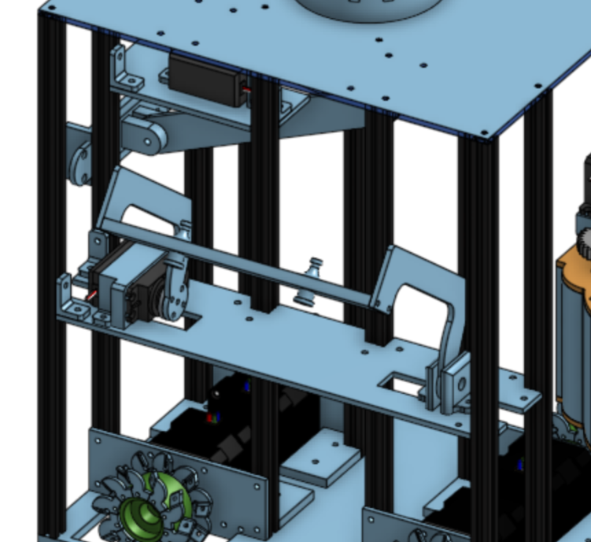

# Actionneurs du robot

Le robot est équipé de 12 servomoteurs et 2 pompes  , répartis stratégiquement sur ses quatre faces afin d’assurer différentes fonctions mécaniques essentielles au bon déroulement des opérations durant la compétition. Chaque groupe de servos est dédié à un sous-système spécifique, conçu pour accomplir des tâches précises et répondre aux besoins du robot en termes d’interactions physiques avec son environnement.

## Coté hardware

Un servomoteur est un moteur électrique équipé d'un système de contrôle qui permet de positionner précisément son axe en fonction d'un signal de commande. Ce signal de commande est un **signal PWM** (Pulse Width Modulation), c'est-à-dire une impulsion périodique dont la durée (le duty cycle) varie.

- La fréquence du signal PWM utilisé pour les servos standards est généralement d’environ 50 Hz (période de 20 ms).
- La position du servo dépend de la durée de l’impulsion haute dans ce cycle. Par exemple :
    - Une impulsion de 1 ms correspond à une position extrême (souvent 0°).
    - Une impulsion de 1,5 ms correspond à la position médiane (environ 90°).
    - Une impulsion de 2 ms correspond à l’autre extrême (souvent 180°).

Pour piloter les servomoteurs, nous utilisons un driver Adafruit PWM Servo Driver. C'est une carte électronique basée sur le circuit intégré PCA9685. Ce circuit permet de générer jusqu'à 16 signaux PWM indépendants avec une fréquence réglable, via un contrôle I2C simple à utiliser.

Ce procédé présente plusieurs avantages tels que la libération des pins PWM du microcontrôleur, le pilotage de 16 servos simultanément et la fréquence duty cycle réglable.

### Fonctionnement du driver

Le PCA9685 est programmé pour générer un signal PWM à environ 50 Hz, adapté aux servos standards. Pour chaque canal (correspondant à un servo), on indique la valeur de début et de fin de l'impulsion haute exprimée en "ticks" sur la période. Le driver convertit ces valeurs en impulsions électriques, ces impulsions pilotent directement les servos, qui positionnent leur axe en fonction de la largeur d'impulsion reçue.

## Répartition et fonctionnalités des servos par face

### Première face : la bannière


{: .text-center }

Cette face est équipée d’un unique servo moteur dédié à la levée d’une bannière. Ce mécanisme simple permet de déposer la bannière de l'équipe sur le bord du plateau de jeu. Le servo actionne un bras qui dépose la bannière de manière fluide et contrôlée sur le bord. Cette dernière est déployé en relachant un aimant libéré lors du mouvement du robot.

```c++
void Actuators::downBanner()
{
    pwm.setPWM(Side::Rear::Lifter, 0, 300);
    delay(1000);
}
```

### Deuxième face : les planches


{: .text-center }

Cette face est constituée d'un servo permettant de lever des ventouses qui aspirent de l'air pour tenir les planches. Le mécanisme aspire, décend au niveau de la planche et remonte.

Il est important de noter que les pompes sont pilotées comme des servos en envoyant une impulsion de 4096 ticks qui permet de les mettre à état haut ou état bas.

```c++
void Actuators::grabPlanks()
{
    if (!isPlanks)
    {
        pwm.setPin(Side::Left::Pump1, 4095);
        pwm.setPin(Side::Left::Pump2, 4095);
        delay(1000);

        isPlanks = true;
    }
}
```

### Troisième face : conserves centrales


{: .text-center }

Sur cette face se trouve trois servos.

Le premier servo sert à lever le corps principal de l’actionneur magnétique, positionnant ainsi l’ensemble en hauteur.

Les deux autres servos sont responsables de la rotation d’une colonne d’aimants. Cette rotation est essentielle pour orienter les aimants afin de les activer ou de les désactiver, ce qui permet au robot d’aimanter ou de libérer des cannettes lors du jeu.

<!-- Image : système d'aimants -->

```c++
void Actuators::grabPotsFront()
{
    pwm.setPWM(Side::Front::RightGraber, 0, 500); // Attach
    pwm.setPWM(Side::Front::LeftGraber, 0, 150); // Attach
    delay(1000);
}

void Actuators::ungrabPotsFront()
{
    pwm.setPWM(Side::Front::RightGraber, 0, 150); // Release
    pwm.setPWM(Side::Front::LeftGraber, 0, 500); // Release
    delay(1000);
}
```

### Quatrième face : conserves exterieures

<!-- Image : la face en question -->

La dernière face est la plus riche en actionneurs, comptant six servos organisés en deux groupes symétriques de trois servos chacun :

- Un servo appelé lifter permet de lever l’ensemble des deux autres servos du groupe, assurant ainsi un mouvement vertical global.
- Le second servo, appelé orienter, permet d’orienter la colonne de servos qui contrôle la direction d’une colonne d’aimants. Cette orientation fine est nécessaire pour positionner avec précision les aimants en fonction de la stratégie.
- Le troisième servo complète le système, intervenant dans la manipulation précise des aimants ou autres mécanismes associés.

Cette architecture à plusieurs niveaux sur cette face permet un contrôle très précis des mouvements complexes, combinant levage et orientation, essentiels pour maximiser l’efficacité des interactions physiques du robot avec son environnement.

```c++
void Actuators::grabPotsRight()
{
    pwm.setPWM(Side::Right::LeftLifter, 0, 300);
    pwm.setPWM(Side::Right::RightLifter, 0, 300);

    pwm.setPWM(Side::Right::LeftOrienter, 0, 350);
    pwm.setPWM(Side::Right::RightOrienter, 0, 350);

    pwm.setPWM(Side::Right::LeftGraber, 0, 150);
    pwm.setPWM(Side::Right::RightGraber, 0, 150);
    delay(1000);
}
```
