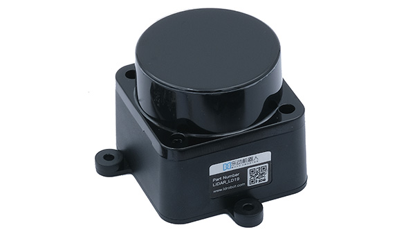

<!-- Include mathjax for mathematical expressions -->

# Le LiDAR

Le réglement de la coupe de France de robotique 2025 impose de détecter l'adversaire. Naturellement beaucoup d'équipes se tournent vers la solution suivante : le capteur LiDAR. Ce dernier émet plusieurs impulsions laser infrarouges par seconde sur une surface puis mesure le temps que met ce signal à revenir vers lui. De ce principe, il peut calculer la distance entre la position de son émission et l'obstacle.

$$Distance = \dfrac{V_{lumière} \times \Delta T}{2}$$

Le capteur LiDAR du RATP, le [LDRobot LD19](https://www.gotronic.fr/userfiles/www.gotronic.fr/files/Fiche%20technique/LD19%20-%20Fiche%20technique%20LD19.pdf), n'envoie pas uniquement des signaux dans une seule direction, il possède un moteur qui le fait tourner à 360° donc ses signaux sont envoyés partout autour de lui. Le capteur est mit sur une tour déterctable par l'adversaire et inversement, le robot adverse posède aussi une tour qui permet au LD19 de notre robot de le détecter.

{: .text-center }

Pour utiliser ce le LD19 avec le µC, on peut se réfèrer à [la librairie](https://github.com/Robot-Maker-SAS/LD06) de [@Mike118](https://github.com/Mike118) et [@JulesTopart](https://github.com/JulesTopart) qui est déstiné au LD06. Ce dernier possède les mêmes caractéristiques techniques que le LD19, seul l'aspect exterieur semble être différent. La librairie permet de régler plusieurs paramètres du LiDAR : d'abord la portée, définie par défaut et limitée techniquement de 0,02 à 12 mètres, peut être réduite car nous n'avons pas besoin de détecter l'ennemi à plus de 3,6 mètres (diagonale de la table) ni à moins de 0,18 mètre (rayon du RATP, donc demie diagonale du cube). Au regard de la vitesse du robot, nous pourrions aussi définir la fréquence d'analyse (rotation du LiDAR par unité de temps) afin d'avoir moins de données à traiter. Nous pouvons aussi ajuster l'angle de détection, nous verons comment utiliser ce paramètre par la suite.

Beaucoup d'améliorations peuvent être apportés au système de détection. Actuellement, nous définissons une distance de detection (prenons 500 mm pour $$l$$) ainsi qu'un angle pour former un arc de cercle dont la mesure $$d$$ est environ égale à la diagonale du robot, de sorte qu'il ne rencontre pas d'obstacles sur la surface qu'il couvre lorsqu'il est en mouvement.

{: .text-center }

À l'avenir, il serait intéressant de rendre une analyse de la table totale : en connaissant la position courrante du robot en passant par AccelStepper, on peut définir dans le programme les dimensions de la table donc filtrer toutes les coordonnées inutiles renvoyées par le LiDAR. Les seuls points détectés dans la zone définies seraient le robot adverse. Nous connaitrions donc sa position en temps réel et éviterons toutes intéractions avec l'exterieur de la table.

Maintenant que nous pouvons nous déplacer et détecter l'ennemi, nous pouvons effectuer des actions sur le plateau afin d'accumuler des points, c'est le role des [actionneurs](./Actionneurs.md).