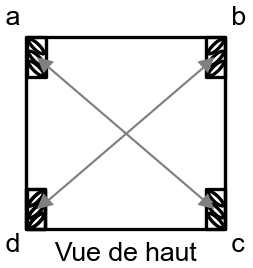

<!-- Include mathjax for mathematical expressions -->

# Déplacements du robot

Le robot est équipé de 4 moteurs pas à pas en forme de carré. Sur ces moteurs sont montées des roues mécanums : ce sont des roues omnidirectionnelles qui permettent de garder l'orientation du robot quelque soit son déplacement. L'équipe a décidé de reprendre ce système de déplacement issue du robot de l'année précédente afin d'éviter de nouveaux travaux.

## Fonctionnement

Avant d'écrire un quelconque programme, il faut connaitre la plateforme utilisée mécaniquement. Comme dit précédemment, le RATP embarque des roues mécanums (ou roues suédoises) qui lui permettent de garder son orientation quelque soit les déplacements. C'est un avantage à l'utilisation mais une contrainte supplémentaire dans le programme. Cette contrainte est la suivante : nous aimerions donner des coordonnées polaires (angle, distance) relatives au robot et qu'il s'y déplace. Le défi auquel nous faisons face est le suivant : comment déplacer le robot suivant un angle quelconque ? En effet, chaque roues ne parcoureront pas la même distance lorsque le robot ira à une distance suivant un angle.

Pour résoudre ce problème, nous utilisons les équations cinématiques indépendantes sur les moteurs afin de déterminer pour chacun, sa vitesse (positive ou négative selon le sens de rotation), son accéleration (strictement suppérieure à zéro) et sa distance.

<!-- TODO : solve how to center the image and the equations in the table -->

| Schéma du robot | Équations correspondantes |
|:-------------|:------------------|
 | $$a = sin(\alpha + \dfrac{\pi}{4})$$   $$b = cos(\alpha + \dfrac{\pi}{4})$$   $$c = -sin(\alpha - \dfrac{\pi}{4})$$   $$d = cos(\alpha - \dfrac{\pi}{4})$$

Des équations ressort un coefficient applicable sur la vitesse, l'acceleration et la distance. Elles permettent aux moteurs pas à pas de terminer leur cycle de mouvement en même temps tout en les déplaçant à des vitesses et des accélérations différentes. Notons qu'il est plus simple de travailler avec un chassis parfaitement carré plutot qu'un chassis rectangulaire.

Une fois ces équations intégrées au programme, nous utilisons plusieurs autres multiplicateurs. D'abord il faut compenser le microstepping : sur notre robot il est réglé à $$\dfrac{1}{8}$$ step, donc toutes nos valeurs doivent être multiplitées par 8.

{: .note}
Le *microstepping* est un terme qui désigne la division de pas des moteurs par les drivers. Il permet d'augmenter la précision et de réduire le bruit des moteurs mais influe forcément sur la vitesse si les paramètres initiaux ne sont pas ajustés en conséquence.

Ensuite, on peut utiliser chaque coefficient pour calculer respectivement la vitesse, l'acceleration et la distance de chacune des roues (rappellons que chaque roue est caractérisée par sa propre vitesse, acceleration, distance). Finallement, on s'occupe de la calibration du robot qui consiste à régler la distance parcourue selon la distance demandée grâce à la table "de poche" construite [en live](https://www.youtube.com/watch?v=39UY1Vs02no) et prêtée par l'équipe des [Karibous](https://github.com/LesKaribous) !

Tous ces réglages se trouve dans [la classe Movement](https://github.com/Robin864/Projet_CDR-2025/tree/main/lib/Movement) et sont totalement transparents dans son utilisation, notamment au sein de la stratégie. La fonction qui s'occupe de déterminer les paramètres de chaque moteur reçoit les paramètres angle et distance qui sont les coordonnées polaires relatives de la destination.

N'oublions pas d'ajouter à notre programme la fonction particulière qu'est la rotation sur lui-même du robot : cette dernière fait tourner les roues opposées diagonalement dans le même sens de rotation. Pour tourner dans un sens ou dans l'autre il suffit d'inverser le sens de rotation de toutes les roues.

## Utilisation

La méthode de la classe *Movement* reçoit les coordonnées polaires de la destinnation, les transforme en coordonnées cartésiennes, les corrige et les appliques aux différents paramètres des moteurs. Pour appliquer ces paramètres, nous utilisons [la librairie AccelStepper](https://www.airspayce.com/mikem/arduino/AccelStepper/classAccelStepper.html). Et la fonction qui s'occupe de la rotation reçoit simplement un angle. Sa vitesse de rotation est définie par la vitesse des moteurs qui est elle même définie par la vitesse par défaut définie dans le programme, qui est relativement lente afin d'éviter toute erreur d'approximation possible. À l'avenir il pourrait être intérressant de pouvoir faire varier cette vitesse selon les situations à l'aide d'un paramètre.

Notre robot se déplace mais rappellons qu'une colision peut couter 50 points à l'équipe soit quasiment la totalité d'un match. C'est pourquoi nous devons implémenter une méthode de détection donc utiliser des [capteurs](./Capteurs.md).
